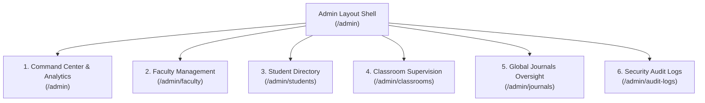

# eJournal — Comprehensive Administrator (Admin) Specification & Architectural Report

> **Document Version:** 1.0.0  
> **Target Audience:** System Architects, Developers, Security Auditors, Educational Administrators  
> **Status:** Authoritative Specification for the eJournal Super Administrator Subsystem  

---

## 1. Executive Overview & Purpose

In the **eJournal — Journal Management & Review System**, the **Super Administrator (`role: "admin"`)** serves as the supreme institutional authority. The Admin subsystem is engineered to provide complete institutional governance, security compliance, faculty provisioning, and academic supervision without violating academic integrity invariants.

### Core Objectives
1. **Institutional Governance:** Central management of all faculty members, students, departments, and academic classrooms across the college or university.
2. **Faculty Provisioning & Lifecycle:** Direct onboarding of verified professors, initial temporary credential generation, and first-time login enforcement.
3. **Academic Continuity:** Reassignment of classrooms when professors change semesters, take sabbatical, or transfer departments, preserving all historical student work, lab practicals, and grades.
4. **Disciplinary & Status Control:** Ability to instantly activate or suspend user accounts (students or faculty) without destroying historical academic records.
5. **Security & Compliance Auditing:** Complete visibility into an immutable, FIFO-capped security audit log tracking all administrative, authentication, and academic lifecycle events.

---

## 2. Architectural Guardrails & System Rules

The Admin subsystem operates under strict rules defined in the project architecture and `documents/RULES.md`. Violating any of these rules constitutes a critical system defect:

### 2.1 Role-Based Access Control (RBAC) Invariants
- **RULE-AUTH07 (Strict RBAC):** Every endpoint prefixed with `/api/v1/admin` is strictly guarded by FastAPI's `RoleChecker(["admin"])`. Any request with a student or teacher JWT is rejected with `HTTP 403 Forbidden`.
- **RULE-AUTH02 (Edge Middleware Enforcement):** Next.js Edge Middleware (`middleware.ts`) inspects the decrypted JWT cookie on every request:
  - If a non-admin attempts to access `/admin` or any `/admin/*` subroute, they are immediately redirected to `/dashboard`.
  - If an authenticated admin visits the root `/` or any `/auth/*` page, they are automatically forwarded to `/admin`.
- **RULE-A04 (No Direct DB Access):** The admin UI in Next.js never connects directly to MongoDB; all management flows strictly through authenticated REST endpoints.

### 2.2 Academic Integrity Guardrails (What Admin CANNOT Do)
- **Academic Non-Interference:** The Administrator **CANNOT** directly edit the block contents of a student's journal. Journals are structured academic records owned by students and assessed by faculty.
- **Grade Immutability:** The Administrator **CANNOT** silently overwrite marks assigned by teachers. Grade modifications require the designated classroom instructor.
- **RULE-AI01 (Zero AI Text Generation):** No AI automated text generation may be used on behalf of students or teachers.
- **No Direct Plaintext Credential Access:** Passwords must never be visible to the admin. When resetting credentials, bcrypt hashes are stored, and only one-time temporary keys are issued.

### 2.3 Administrative Authority (What Admin CAN Do)
- Provision faculty accounts and dispatch invitation emails.
- Suspend or reactivate any student or faculty member instantly.
- Force-reset forgotten credentials with high-entropy temporary passwords.
- Reassign classroom ownership from one teacher to another.
- Oversee global submission queues, approval metrics, and system-wide journal completion.
- Inspect system-wide audit logs with client IP addresses and actor tracking.

---

## 3. Comprehensive Functional Modules

The Admin subsystem is structured into six dedicated modules accessible from the Liquid Glass sidebar:



---

### 3.1 Module 1: Admin Command Center (Dashboard & Real-Time Analytics)
**Route:** `/admin`  
**API Endpoint:** `GET /api/v1/admin/stats`

#### Functionality:
- **System KPI Metrics:**
  - **Total Students:** Count of all verified student profiles.
  - **Faculty Members:** Count of onboarded professors and instructors.
  - **Active Classrooms:** Count of operational academic lab classrooms.
  - **Global Journals:** Total number of journals created across the platform.
  - **Pending Submissions:** Count of student journals currently awaiting faculty review.
  - **Approved Journals:** Count of finalized and approved practical submissions.
- **Live Activity Feed:** Chronological stream of the 8 most recent critical platform events (logins, submissions, faculty provisioning, status changes).
- **System Health Indicator:** Displays server environment, MongoDB connection health, and Redis latency.

---

### 3.2 Module 2: Faculty Management (Teacher Provisioning & Lifecycle)
**Route:** `/admin/faculty`  
**API Endpoints:**
- `GET /api/v1/admin/users?role=teacher` (List & search)
- `POST /api/v1/admin/faculty` (Provision new teacher)
- `PATCH /api/v1/admin/users/{id}/status` (Toggle active/suspended)
- `POST /api/v1/admin/users/{id}/reset-password` (Force password reset)

#### Functionality:
- **Verified Faculty Provisioning:**
  - Admin inputs: **Full Name**, **Institutional Email**, **Department**, and **Designation** (Assistant Professor, Associate Professor, Head of Department, Lab Instructor).
  - Admin may specify an initial password or allow the system to auto-generate a cryptographically secure 12-character temporary password (`secrets.token_urlsafe(8) + "!1Aa"`).
  - The account is created with `role: "teacher"`, `is_verified: True`, `is_profile_complete: True`, and `must_change_password: True`.
  - **Automated Welcome Email:** Dispatches an institutional email to the teacher with their email, temporary password, and secure login portal link.
- **First-Time Login Security Guard:**
  - When the newly created teacher logs in, the Next.js Edge Middleware and Login router detect `must_change_password: true`.
  - The teacher is immediately locked into `/auth/change-password` and cannot enter the dashboard until they set a personal password (min 8 characters).
- **Account Suspension & Reactivation:**
  - Admin can toggle teacher accounts between `active` and `suspended`. Suspended teachers cannot log in or access classrooms.
- **Force Password Reset:**
  - In case a faculty member forgets their password or loses access, the admin can generate a new temporary password on the spot.

---

### 3.3 Module 3: Student Directory & Academic Supervision
**Route:** `/admin/students`  
**API Endpoints:**
- `GET /api/v1/admin/users?role=student` (Paginated list with search)
- `PATCH /api/v1/admin/users/{id}/status` (Suspend / Activate)
- `POST /api/v1/admin/users/{id}/reset-password` (Emergency reset)

#### Functionality:
- **University Student Directory:**
  - Real-time debounced multi-field search: Search by Student Name, Institutional Email, or Enrollment Number (Roll Number).
  - Filter by Department (Computer Engineering, Information Technology, Mechanical, Civil, Electrical, etc.).
- **Academic Detail Inspection:**
  - Displays Semester, Division, Lab Batch (e.g., Batch B1, B2), College, and Profile Completion status.
- **Disciplinary Account Suspension:**
  - If a student violates academic integrity or leaves the university, the admin can suspend their account with a single click, instantly blocking login access while preserving all submitted journals for administrative records.

---

### 3.4 Module 4: Classroom Supervision & Teacher Reassignment
**Route:** `/admin/classrooms`  
**API Endpoints:**
- `GET /api/v1/admin/classrooms` (List all classrooms)
- `PATCH /api/v1/admin/classrooms/{id}/reassign` (Transfer classroom teacher)

#### Functionality:
- **Campus-Wide Classroom Registry:**
  - Lists every academic classroom across all departments.
  - Displays: Subject Name, Subject Code (e.g., CS301), Academic Semester, Current Instructor Name, Student Enrollment Count, Published Assignments Count, and Join Code.
- **Classroom Ownership Reassignment (Academic Continuity):**
  - **Use Case:** A professor is on medical leave, transferred, or a new instructor takes over a course mid-semester.
  - Admin selects "Reassign Teacher", picks another faculty member from the dropdown, and submits.
  - **Data Preservation:** The classroom ownership transfers to the new teacher. All student enrollments, batches, published assignments, submitted student journals, annotations, and grades remain 100% intact.
  - Generates an immutable audit event: `CLASSROOM_REASSIGNED`.

---

### 3.5 Module 5: Global Journal Supervision & Academic Oversight
**Route:** `/admin/journals`  
**API Endpoint:** `GET /api/v1/admin/journals`

#### Functionality:
- **Global Academic Review Registry:**
  - Provides institutional bird's-eye visibility over every journal created in the system.
  - Displays: Student Name, Enrollment Number, Classroom Subject, Assignment Title, Current Revision Number, and Evaluation Status.
- **Multi-Status Filtering:**
  - Filter journals across 5 academic states:
    1. `draft`: In progress by student.
    2. `submitted`: Turned in on time, waiting for teacher review.
    3. `late_submitted`: Turned in after assignment deadline.
    4. `changes_requested`: Reviewed by teacher with feedback; waiting for revision.
    5. `approved`: Verified, graded, and locked with institutional sign-off.
- **Search Capabilities:** Search by student name, enrollment ID, or practical assignment title.

---

### 3.6 Module 6: Immutable Security Audit Logs (Compliance Engine)
**Route:** `/admin/audit-logs`  
**API Endpoint:** `GET /api/v1/admin/audit-logs`

#### Functionality:
- **Comprehensive Audit Tracking (RULE-SEC10):**
  - Every critical action across the platform writes an immutable log record into MongoDB collection `audit_logs`.
- **Logged Event Types:**
  - `USER_REGISTERED` & `EMAIL_VERIFIED`
  - `USER_LOGGED_IN`
  - `FACULTY_CREATED` (records which admin created the teacher)
  - `USER_STATUS_UPDATED` (records activation / suspension)
  - `USER_PASSWORD_RESET` & `PASSWORD_CHANGED`
  - `CLASSROOM_CREATED` & `CLASSROOM_REASSIGNED`
  - `JOURNAL_SUBMITTED`, `CHANGES_REQUESTED`, & `JOURNAL_APPROVED`
- **Audit Metadata Captured:**
  - **Actor:** `userId` and user email.
  - **Action:** Standardized uppercase event code.
  - **Entity & Entity ID:** Target resource (e.g. `users`, `classrooms`, `journals`).
  - **Client IP Address:** Real client IP address extracted from `request.client.host`.
  - **Timestamp:** ISO 8601 UTC timestamp.
- **Automatic FIFO Log Pruning Engine:**
  - To prevent unbounded storage growth while satisfying compliance, the database repository enforces an automatic FIFO cap of **10,000 entries**.
  - When audit logs exceed 10,000, the oldest entries are automatically pruned.

---

## 4. Complete API Reference

All Admin routes require HTTP Authorization via Bearer JWT or HTTP-only `access_token` cookie containing `role: "admin"`.

| Method | Endpoint | Query / Body Payload | Response Data | Purpose |
| :--- | :--- | :--- | :--- | :--- |
| `GET` | `/api/v1/admin/stats` | None | `{ stats: {...}, recentActivity: [...] }` | High-level KPI metrics & recent activity feed |
| `GET` | `/api/v1/admin/users` | `?role=teacher\|student`, `search`, `department`, `page`, `limit` | `{ users: [...], total, page, totalPages }` | Paginated directory with multi-field search |
| `POST` | `/api/v1/admin/faculty` | `{ name, email, department, designation, password? }` | `{ id, email, name, role, initialPassword, message }` | Direct faculty onboarding with welcome email |
| `PATCH` | `/api/v1/admin/users/{id}/status` | `{ status: "active" \| "suspended" }` | `{ id, status, message }` | Toggle user active/suspended state |
| `POST` | `/api/v1/admin/users/{id}/reset-password` | `{ newPassword: string }` | `{ id, message }` | Administrative emergency password reset |
| `DELETE` | `/api/v1/admin/users/{id}` | None | `{ id, message }` | Permanent user deletion with audit record |
| `GET` | `/api/v1/admin/classrooms` | `?search=...`, `page`, `limit` | `{ classrooms: [...], total, page, totalPages }` | Institutional classroom directory with enrollment counts |
| `PATCH` | `/api/v1/admin/classrooms/{id}/reassign` | `{ newTeacherId: string }` | `{ classroomId, newTeacherId, message }` | Reassign classroom to new faculty member |
| `GET` | `/api/v1/admin/journals` | `?classroomId=...`, `status`, `search`, `page`, `limit` | `{ journals: [...], total, page, totalPages }` | Global multi-status student journal inspection |
| `GET` | `/api/v1/admin/audit-logs` | `?action=...`, `page`, `limit` | `{ logs: [...], total, page, totalPages }` | System security audit trail with IP tracking |

---

## 5. Database Schema & MongoDB Structure

### 5.1 Admin User Document (`users` collection)
```json
{
  "_id": "67b9318f2f2...",
  "email": "admin@ejournal.com",
  "password_hash": "$2b$12$...",
  "role": "admin",
  "is_verified": true,
  "is_profile_complete": true,
  "must_change_password": false,
  "status": "active",
  "profile": {
    "name": "Super Administrator",
    "department": "Administration",
    "designation": "System Administrator",
    "college": "Engineering & Technology Institute"
  },
  "createdAt": "2026-09-22T06:00:00.000Z",
  "updatedAt": "2026-09-22T06:00:00.000Z"
}
```

### 5.2 Provisioned Faculty Document (`users` collection)
```json
{
  "_id": "67b9318f2f3...",
  "email": "prof.sharma@ejournal.com",
  "password_hash": "$2b$12$...",
  "role": "teacher",
  "is_verified": true,
  "is_profile_complete": true,
  "must_change_password": true,
  "status": "active",
  "profile": {
    "name": "Dr. Ramesh Sharma",
    "department": "Computer Science & Engineering",
    "designation": "Associate Professor",
    "college": "Engineering & Technology Institute"
  },
  "createdAt": "2026-09-22T07:15:00.000Z",
  "updatedAt": "2026-09-22T07:15:00.000Z"
}
```

### 5.3 Audit Log Document (`audit_logs` collection)
```json
{
  "_id": "67b9318f2f4...",
  "userId": "67b9318f2f2...",
  "action": "FACULTY_CREATED",
  "entity": "users",
  "entityId": "67b9318f2f3...",
  "ip_address": "127.0.0.1",
  "metadata": {},
  "timestamp": "2026-09-22T07:15:00.000Z"
}
```

---

## 6. Frontend User Experience & UI Specifications

The Admin interface adheres strictly to **Apple Human Interface Guidelines (HIG)** and **Impeccable Design Standards**:

1. **Liquid Glass Navigation Shell ([layout.tsx](file:///c:/Users/patel/Desktop/eJournal-main/frontend/src/app/admin/layout.tsx)):**
   - Translucent frosted glass sidebar (`backdrop-blur-2xl`, subtle specular highlights).
   - High-contrast active navigation state with amber-accented indicators.
   - Quick Admin Profile Pill in the footer showing active admin email and a one-click **Sign Out** button that thoroughly flushes all cookies and React Query memory.
2. **Accessible Interaction States:**
   - Visual feedback on hover, focus, and press.
   - Accessible keyboard navigation across all tables, modal forms, and pagination buttons.
   - Real-time debounced search inputs with loading spinner indicators.
3. **Modal Dialogs:**
   - Dedicated modal for "Create Faculty Member" with instant temporary password copy-to-clipboard.
   - Confirmation dialogs for destructive actions (e.g. Account Suspension, Classroom Reassignment).

---

## 7. Security & Environment Configuration

### Default Super Administrator Credentials
- **Email:** `admin@ejournal.com`
- **Default Password:** `Admin@123456`
- **Database:** MongoDB Atlas `ejournal` database, collection `users`.

### Production Security Checklist
- Ensure `ENVIRONMENT=production` in Render and local environments.
- Configure `JWT_SECRET_KEY` with a minimum 32-character high-entropy cryptographic string.
- Cookies are transmitted with `SameSite=None`, `Secure=True`, and `HttpOnly=True`.
- CORS allows frontend origins with preflight caching enabled (`max_age=86400`).
